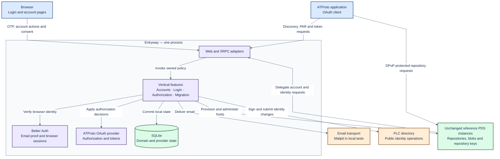
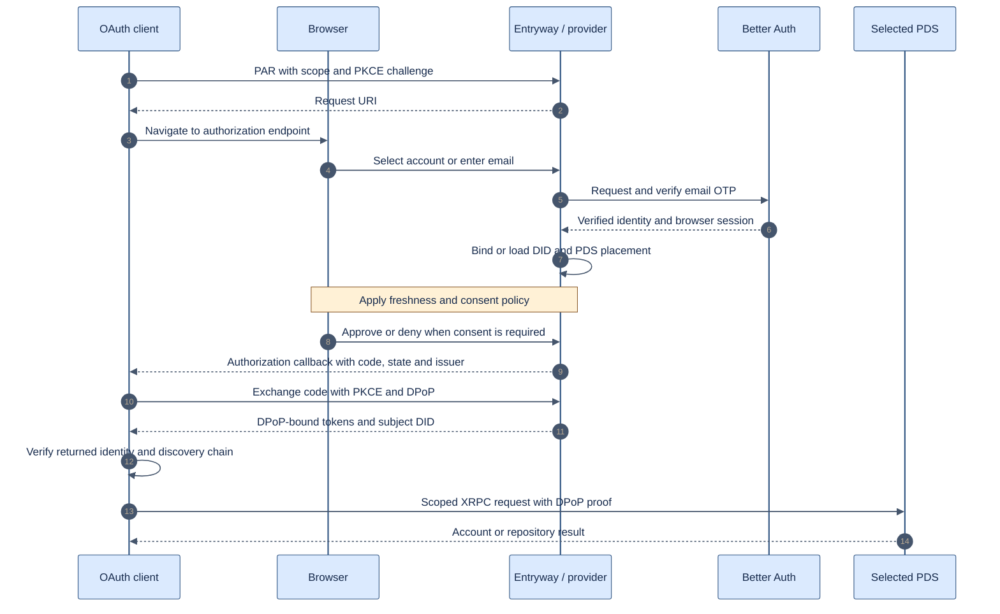

# Entryway architecture

Status: vertical feature structure; product requirements and gaps below remain explicit.
Updated: 2026-10-05. This document distinguishes target behaviour from implemented behaviour.

Read alongside the [project plan](delivery-plan.md), [data and custody design](data-custody.md),
[reuse assessment](reuse-assessment.md), and [local test guide](testing.md).

## 1. Purpose and fixed boundaries

Build one small TypeScript Entryway for several unchanged Bluesky reference PDS instances.
Move ePDS email OTP authentication into the supported Entryway integration boundary.
Preserve ePDS login behaviour and provide a styled account page.

The complete service must meet applicable ATProto, OAuth and XRPC contracts.
Users must migrate in using existing, unmodified migration tools and normal account credentials.
Public migration must not require operator database edits or private fixture APIs.

Use the reference PDS hooks, lexicons and tests as the integration contract.
Do not fork or patch the PDS. Keep the upstream ATProto OAuth provider.
Better Auth supplies browser authentication and email proof; it does not replace that provider.

Google/GitHub login, automatic balancing, autoscaling and a general cluster scheduler are out of scope.
Start with one Entryway process, SQLite and an in-process durable-operation runner.
This deployment choice still requires recovery, backups and explicit transaction boundaries.

## 2. System overview

This is the target responsibility map. Fleet administration and independent-tool migration remain incomplete.
The account page is part of Entryway. Better Auth and the provider run within its process.
PDS instances own repository data and repository signing keys.

The provider and Better Auth also persist their own state through their adapters.
The overview groups persistence for readability; domain ownership is defined below.
Arrows describe interactions, not direct permission to read another component's tables.

## 3. Feature ownership

One process contains vertical features. Each feature owns the operation that a
user performs, its HTTP/XRPC handlers, feature-specific page and tests.

| Feature | Owns |
| --- | --- |
| email-login | Email proof, login flow and browser-session ending |
| account-registration | Reservation/provisioning, signup proof, invitations and signup page |
| account-settings | Email/backup/password changes, status and account summary |
| account-deletion | Deletion proof and durable PDS deletion completion |
| handle-change | Hosted-handle validation, PLC publication and PDS callback |
| account-recovery | Backup proof and replacement email recovery |
| oauth-authorization | Provider configuration, authorization/consent and scope references |
| connected-apps | Grants, device memberships, browser sessions and app passwords |
| pds-migration | Existing-account movement and its proof/progress |
| external-migration | Typed import journal/state machine and synthetic import orchestration |

A feature does not import another feature. Short root compose modules wire explicit
operations together. Shared accounts code owns common facts, validation and proof
primitives. A shared account summary can display feature-owned panels supplied by
composition without importing those features.

The two engineers can change separate feature files end to end. Changes to shared
transaction contracts, browser identity, signing custody and migration numbering
still require coordination. See AGENTS.md for enforceable source rules.

## 4. Three boundaries

| Boundary | Port | Implementation |
| --- | --- | --- |
| Browser authentication | Normalized verified identity/session operations | Better Auth |
| Mail sending | Deliver a fully formed message | SMTP |
| Database | Focused readers and atomic state operations | SQLite |

PDS, PLC, OAuth provider and signing operations are concrete modules. They do not
have parallel interchangeable port hierarchies. Provider state storage belongs to
the database boundary. Mail templates/retry/expiry remain concrete delivery logic;
its persistent outbox contracts live under database.

`src/features/<feature>/` is the starting point for a feature change.
`src/main.mjs` owns startup/shutdown and workers; `src/app.mjs` owns middleware and
route ordering; `src/compose-*.mjs` assembles features. Shared HTTP/UI helpers are
under `src/http` and `src/ui`. Database schema migrations have one ordered registry.
The build emits `dist/src`; preserved MJS ownership is inventoried in
[source ownership](source-ownership.json). TS remains strict; MJS extraction is
not a claim of full typed conversion.

The SQLite account-authority helper retains pinned Better Auth schema knowledge.
Email authority, claims, identity mappings and invalidation remain one synchronous
transaction, with rollback contracts. Browser authentication proves a browser
identity; PLC custody and DID authority remain separate.

Synthetic source migration clients/signers live in tests/fixtures. The current
external-import service has two explicit type-only references to these concrete
classes because its only current invocation is the managed synthetic harness;
those imports are erased from runtime output. They are not a public source
implementation. Standard-tool migration and general custody remain release gates.

The architecture checker resolves real imports, including TS/MJS aliases, dynamic
imports and require. It rejects extra ports, raw SQL/SMTP/Better Auth access outside
owned boundaries, feature-internal imports, runtime cycles and impure rule modules.

## 5. Login and application authorization

The sequence shows the proposed complete journey, not a claim of ePDS parity today.
Account choice, proof freshness and consent remain separate policy decisions.
Public and confidential clients both need acceptance coverage.

Confidential clients also supply client authentication where required.
The account page distinguishes ending a browser session, forgetting device membership,
and revoking application access. Revocation effects must be explicit, including outstanding access-token lifetime.

## 6. PDS integration and fleet lifecycle

Maintain a protocol matrix for every applicable Entryway hook and XRPC method.
Record the serving host, credential type, request/response schemas, error behaviour and side effects.
Include PDS callbacks, handle resolution, account lifecycle, identity operations and scope references.
Reference source and tests define the contract; endpoint presence does not prove conformance.

The proposed registry lifecycle is operator controlled:

```mermaid
%%{init: {"theme":"base","themeVariables":{"primaryTextColor":"#172B4D","lineColor":"#45556C","edgeLabelBackground":"#FFFFFF","fontFamily":"Arial"}}}%%
flowchart LR
  registered["Registered<br/>Not eligible for placement"]
  enabled["Enabled<br/>Accept new placements"]
  draining["Draining<br/>Move existing accounts"]
  retired["Retired<br/>Retain required history"]
  registered -->|"Validate trust, routes and health"| enabled
  enabled -->|"Operator stops new placement"| draining
  draining -->|"No placements, transfers or retention blockers"| retired
  draining -->|"Operator cancels drain"| enabled
  classDef blue fill:#DBEAFE,stroke:#315582,color:#172B4D,stroke-width:2px;
  classDef mint fill:#DCFCE7,stroke:#32694D,color:#172B4D,stroke-width:2px;
  classDef peach fill:#FFEDD5,stroke:#8A5A2B,color:#172B4D,stroke-width:2px;
  classDef violet fill:#EDE9FE,stroke:#65538A,color:#172B4D,stroke-width:2px;
  class registered blue;
  class enabled mint;
  class draining peach;
  class retired violet;
```

Health is a separate observation from lifecycle state.
An unhealthy enabled PDS must not receive new placements.
A planned drain assumes a readable source. Disaster recovery requires a separate restore procedure.
Removing a configuration entry is not retirement.

## 7. Current baseline and delivery gaps

Reuse provider wiring, OTP integration, account constraints, indexed device lookup,
PDS call sequences, journals, branding, mail ports and regression scenarios.
Keep shared contracts narrow while features own their operation bodies.

Still required: ePDS consent/freshness parity, complete XRPC adapters, production email delivery,
fleet lifecycle, general custody policy and standard-tool migration.
The typed external workflow is invoked by the synthetic harness; managed account moves live in pds-migration.
The existing fixture proves useful mechanics but uses its own source-control API.

See [data and custody](data-custody.md) for actual cutover ordering and unresolved decisions.
No current build, runtime or conformance result is asserted by these diagrams.

## Decisions required before implementation

The operator-ownership decision in [TECH-698](https://linear.app/hypercerts/issue/TECH-698) records operator ownership and the relationship to TECH-547 email discovery. The current design shares authentication across its PDS fleet; independent authentication and a discovery router require separate decisions. [TECH-697](https://linear.app/hypercerts/issue/TECH-697) defines conversion of an existing ePDS deployment without moving its repositories, including old URLs and rollback. These decisions do not authorize changes to the reference PDS.
