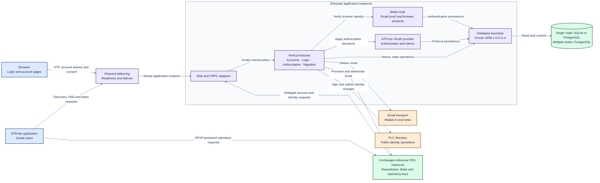
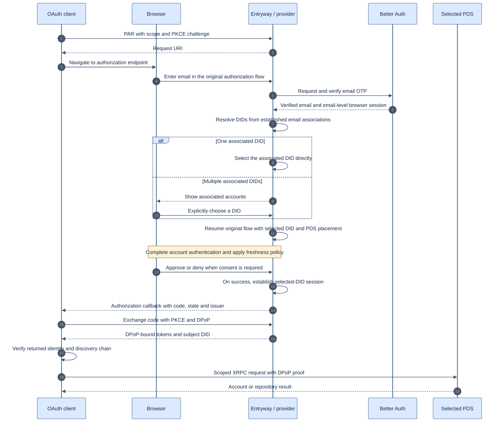

# Entryway architecture

Status: vertical feature structure; product requirements and gaps below remain explicit.
Updated: 2026-10-07. This document distinguishes target behaviour from implemented behaviour.

Read alongside the [delivery reference](delivery-plan.md), [data and custody design](data-custody.md),
[reuse assessment](reuse-assessment.md), and [local test guide](testing.md).

## 1. Purpose and fixed boundaries

Build an Entryway for several unchanged Bluesky reference PDS instances.
Move ePDS email OTP authentication into the supported Entryway integration boundary.
Preserve ePDS login behaviour and provide a styled account page.

The complete service must meet applicable ATProto, OAuth and XRPC contracts.
Migration acceptance is compliance with public endpoints and normal account
credentials, without operator database edits or private fixture APIs. Existing
unmodified tools may exercise those contracts; no specific tool or version is a
prerequisite. Record versions only for reproducibility when a tool is used.

Use the reference PDS hooks, lexicons and tests as the integration contract.
Do not fork or patch the PDS. Keep the upstream ATProto OAuth provider.
Better Auth supplies browser authentication and email proof; it does not replace that provider.

Google/GitHub OIDC is on the roadmap and excluded from initial delivery.
Scaling, request balancing and failover are in scope for resilience. Recovery,
backups and explicit transaction boundaries remain required.

The database boundary implements SQLite and PostgreSQL through Drizzle ORM,
pinned to `1.0.0-rc.4`, with asynchronous operations and shared authority transactions.
[Shared operation ownership](shared-operations.md) coordinates account work, mail
and authentication; [deployment lifecycle](deployment-profiles.md) defines bounded
readiness, draining and replica checks. Single-node operation accepts SQLite or
PostgreSQL; multi-node configuration requires PostgreSQL.
See [database configuration and contracts](database.md). These code changes start
from fresh state: no backward-compatibility layer or existing-data conversion is
required. This does not remove public account migration or conversion of an
existing ePDS deployment from product scope.

## 2. System overview

This is the target responsibility map. Fleet administration and public-protocol migration remain incomplete.
The account page is part of Entryway. Better Auth and the provider run inside each
application instance; feature boundaries do not prescribe separately deployed services.
PDS instances own repository data and private repository signing keys, distinct
from PLC rotation authority. The approved custody model uses an Entryway hot PLC
key, operator offline recovery and an optional user recovery key. Existing PDS
rotation authority is preserved on adoption within PLC rules; normal departure
may replace former host authority with valid destination keys. See
[custody boundaries](data-custody.md#4-custody-boundaries) for priority and exit limits.

The provider and Better Auth also persist their own state through their adapters.
The overview groups persistence for readability; domain ownership is defined below.
Arrows describe interactions, not direct permission to read another component's tables.

## 3. Feature ownership

Each application instance contains the same vertical features. Each feature owns the operation that a
user performs, its HTTP/XRPC handlers, feature-specific page and tests.

| Feature              | Owns                                                                  |
| -------------------- | --------------------------------------------------------------------- |
| email-login          | Email proof, login flow and browser-session ending                    |
| account-registration | Reservation/provisioning, signup proof, invitations and signup page   |
| account-settings     | Email/backup/password changes, status and account summary             |
| account-deletion     | Deletion proof and durable PDS deletion completion                    |
| handle-change        | Hosted-handle validation, PLC publication and PDS callback            |
| account-recovery     | Backup proof and replacement email recovery                           |
| oauth-authorization  | Provider configuration, authorization/consent and scope references    |
| connected-apps       | Grants, device memberships, browser sessions and app passwords        |
| pds-migration        | Existing-account movement and its proof/progress                      |
| external-migration   | Typed import journal/state machine and synthetic import orchestration |

A feature does not import another feature. Short root compose modules wire explicit
operations together. Shared accounts code owns common facts, validation and proof
primitives. A shared account summary can display feature-owned panels supplied by
composition without importing those features.
Changes to shared transaction contracts, browser identity, signing custody and
schema initialization require coordinated review. See AGENTS.md for enforceable source rules.

## 4. Three boundaries

| Boundary               | Port                                                     | Implementation                                                                                                                                                                                                       |
| ---------------------- | -------------------------------------------------------- | -------------------------------------------------------------------------------------------------------------------------------------------------------------------------------------------------------------------- |
| Browser authentication | Normalized verified identity/session operations          | Better Auth                                                                                                                                                                                                          |
| Mail sending           | Deliver a fully formed message                           | SMTP                                                                                                                                                                                                                 |
| Database               | Focused asynchronous readers and atomic state operations | Drizzle ORM `1.0.0-rc.4`; fresh SQLite/PostgreSQL schemas and async operations. Single node accepts either backend; multi-node configuration requires PostgreSQL; complete production qualification remains separate |

PDS, PLC, OAuth provider and signing operations are concrete modules. They do not
have parallel interchangeable port hierarchies. Provider state storage belongs to
the database boundary. Mail templates/retry/expiry remain concrete delivery logic;
its persistent outbox contracts live under database.

`src/features/<feature>/` is the starting point for a feature change.
`src/main.mjs` owns startup/shutdown and workers; `src/app.mjs` owns middleware and
route ordering; `src/compose-*.mjs` assembles features. Shared HTTP/UI helpers are
under `src/http` and `src/ui`. The database boundary serializes fresh schema
initialization and checks the dialect asset hash stored in `schema_identity`;
Better Auth does not run separate schema mutations.
The build emits `dist/src`; preserved MJS ownership is inventoried in
[source ownership](source-ownership.json). TS remains strict; MJS extraction is
not a claim of full typed conversion.

The database account-authority helper retains pinned Better Auth schema knowledge.
Email authority, claims, identity mappings and invalidation remain one atomic
transaction, with rollback contracts. PostgreSQL requires asynchronous operations;
callers must await completion without splitting the authority transaction into
unrelated provider calls. Browser authentication proves a browser
identity; PLC custody and DID authority remain separate.

Synthetic source migration clients/signers live in tests/fixtures. The current
external-import service has two explicit type-only references to these concrete
classes because its only current invocation is the managed synthetic harness;
those imports are erased from runtime output. They are not a public source
implementation. Public-protocol migration and implementation of the approved
custody model remain release gates. Standard PLC confirmation, signature and
publication authorize individual migration; destination email proof separately
binds login and may use a different address from the source. Whole-PDS joining
imports established DID/email associations. Neither route adds a bespoke ownership
proof or permits email matching alone to establish DID authority.

The architecture checker resolves real imports, including TS/MJS aliases, dynamic
imports and require. It rejects extra ports, raw SQL/SMTP/Better Auth access outside
owned boundaries, feature-internal imports, runtime cycles and impure rule modules.

## 5. Login and application authorization

The sequence shows the target sign-in journey for existing associated accounts,
not a claim of ePDS parity today.
The approved sign-in policy verifies email before resolving associated DIDs, then
requires an explicit choice if more than one is associated. The joining-PDS
association import, schema changes and chooser remain unimplemented; see
[account identity](data-custody.md#1-account-identity-and-ownership). Proof freshness
and consent remain separate policy decisions. Public and confidential clients
both need acceptance coverage.

The Better Auth session proves the email identity; it does not itself select or
authenticate a DID. Only established associations are eligible for account choice;
matching an email cannot add authority over an unimported DID. Preserve the
original client request and authorization context through verification and choice.

Confidential clients also supply client authentication where required.
The account page distinguishes ending a browser session, forgetting device membership,
and revoking application access. Revocation effects must be explicit, including outstanding access-token lifetime.

## 6. PDS integration and fleet lifecycle

Maintain a protocol matrix for every applicable Entryway hook and XRPC method.
Record the serving host, credential type, request/response schemas, error behaviour and side effects.
Include PDS callbacks, handle resolution, account lifecycle, identity operations and scope references.
Reference source and tests define the contract; endpoint presence does not prove conformance.

The proposed registry lifecycle is operator controlled:

```mermaid
%%{init: {"theme":"base","themeVariables":{"primaryTextColor":"#172B4D","lineColor":"#45556C","edgeLabelBackground":"#FFFFFF","fontFamily":"Arial"}}}%%
flowchart LR
  registered["Registered<br/>Not eligible for placement"]
  enabled["Enabled<br/>Accept new placements"]
  draining["Draining<br/>Move existing accounts"]
  retired["Retired<br/>Retain required history"]
  registered -->|"Validate trust, routes and health"| enabled
  enabled -->|"Operator stops new placement"| draining
  draining -->|"No placements, transfers or retention blockers"| retired
  draining -->|"Operator cancels drain"| enabled
  classDef blue fill:#DBEAFE,stroke:#315582,color:#172B4D,stroke-width:2px;
  classDef mint fill:#DCFCE7,stroke:#32694D,color:#172B4D,stroke-width:2px;
  classDef peach fill:#FFEDD5,stroke:#8A5A2B,color:#172B4D,stroke-width:2px;
  classDef violet fill:#EDE9FE,stroke:#65538A,color:#172B4D,stroke-width:2px;
  class registered blue;
  class enabled mint;
  class draining peach;
  class retired violet;
```

Health is a separate observation from lifecycle state.
An unhealthy enabled PDS must not receive new placements.
A planned drain assumes a readable source. Disaster recovery requires a separate restore procedure.
Removing a configuration entry is not retirement.

## 7. Current baseline and delivery gaps

Reuse provider wiring, OTP integration, atomic account/DID invariants, indexed device lookup,
PDS call sequences, journals, branding, mail ports and regression scenarios.
Keep shared contracts narrow while features own their operation bodies.

Still required: the approved multiple-DID email schema, joining-PDS association import
and post-verification chooser, ePDS consent/freshness parity, complete XRPC adapters, production email delivery,
fleet lifecycle, implementation of the approved custody model and public-protocol migration. The [Drizzle database boundary](database.md) provides asynchronous authority
transactions. [Shared operation ownership](shared-operations.md) implements durable
account/PDS admission, execution fences, operator-verified uncertain-write recovery,
mail attempts and authentication ordering. [Deployment lifecycle](deployment-profiles.md)
provides readiness/draining and three profile controllers. Fleet placement and
complete production qualification remain separate work. The
[implementation assessment](implementation-assessment.md#known-limits) records
remaining limits, including moderation and the credential-lifetime defect.
The typed external workflow is invoked by the synthetic harness; managed account moves live in pds-migration.
The existing fixture proves useful mechanics but uses its own source-control API.

See [data and custody](data-custody.md) for actual cutover ordering and unresolved decisions.
No current build, runtime or conformance result is asserted by these diagrams.

## Resilience and shared state

Request balancing must preserve one issuer and consistent signing configuration.
Multi-node application instances use PostgreSQL for shared durable account,
authentication and operation state. A single-node deployment can use SQLite or
PostgreSQL; the [database guide](database.md) describes bounded restart and restore
checks. SQLite is not a multi-node failover store. Configuration
must reject SQLite in multi-node mode. Each deployment profile must state database
availability, readiness, draining, worker ownership and recovery behavior explicitly.

A worker must claim an operation durably before issuing external side effects.
Versioned updates and bounded ownership prevent another instance or a stale worker
from completing the same transition. A lost SMTP acknowledgement can still mean
mail was delivered; do not promise exactly-once delivery. PDS/PLC outcomes must be
observed before retrying ambiguous mutations. For an unacknowledged mutable PDS
request, observation also requires evidence that the old dispatcher cannot resume
and that old upstream work has completed or been drained. A matching status read
or expired lease alone never clears its durable pending admission; see the
[operator recovery contract](shared-operations.md#supported-operator-recovery).

Balancing Entryway requests does not relocate a repository or replicate PDS data.
PDS placement, drain, transfer and disaster recovery retain their own authority,
data-integrity and recovery requirements.

## Open design decisions

Operator ownership, independent authentication, email discovery, operational key
management, recovery execution and deployment-conversion details are maintained in the
[Linear project](https://linear.app/hypercerts/project/epds-entryway-888a35a63fe4) and [project document](https://linear.app/hypercerts/document/m1-acceptance-matrices-epds-parity-protocol-and-migration-196f21e01e71). Scaling does not imply
independent authentication operators. These decisions do not authorize reference
PDS changes. See [implementation assessment](implementation-assessment.md) for source-grounded
work required by the current architecture.
