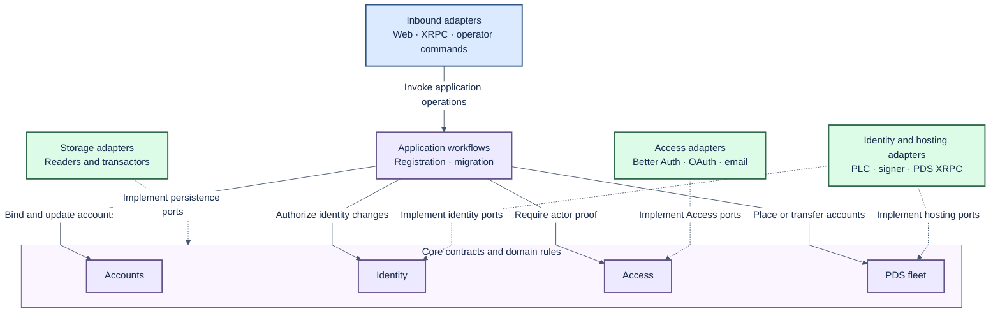
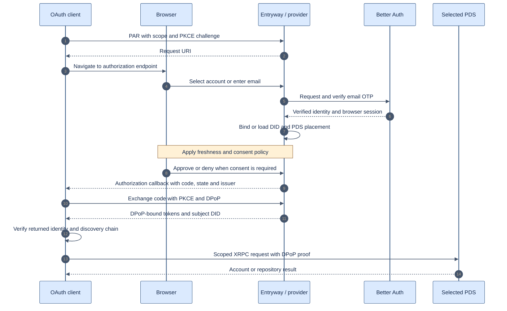

# Mini Entryway architecture

Status: proposed delivery architecture, based on the imported spike review.
Updated: 2026-09-30. This document distinguishes target behaviour from implemented behaviour.

Read alongside the [project plan](delivery-plan.md), [data and custody design](data-custody.md),
[reuse assessment](reuse-assessment.md), and [local test guide](testing.md).

## 1. Purpose and fixed boundaries

Build one small TypeScript Entryway for several unchanged Bluesky reference PDS instances.
Move ePDS email OTP authentication into the supported Entryway integration boundary.
Preserve ePDS login behaviour and provide a styled account page.

The complete service must meet applicable ATProto, OAuth and XRPC contracts.
Users must migrate in using existing, unmodified migration tools and normal account credentials.
Public migration must not require operator database edits or private fixture APIs.

Use the reference PDS hooks, lexicons and tests as the integration contract.
Do not fork or patch the PDS. Keep the upstream ATProto OAuth provider.
Better Auth supplies browser authentication and email proof; it does not replace that provider.

Google/GitHub login, automatic balancing, autoscaling and a general cluster scheduler are out of scope.
Start with one Entryway process, SQLite and an in-process durable-operation runner.
This deployment choice still requires recovery, backups and explicit transaction boundaries.

## 2. System overview

This is the target responsibility map. Fleet administration and independent-tool migration remain incomplete.
The account page is part of Entryway. Better Auth and the provider run within its process.
PDS instances own repository data and repository signing keys.


The provider and Better Auth also persist their own state through their adapters.
The overview groups persistence for readability; domain ownership is defined below.
Arrows describe interactions, not direct permission to read another component's tables.

## 3. Feature domains

| Domain | Owns | Does not own |
| --- | --- | --- |
| Accounts | DID-primary account, login identity binding, email/handle claims, account status and settings | OAuth grants, private repository keys or fleet policy |
| Identity | Handle/DID changes, PLC authority, custody policy, recovery and signing authorization | Repository storage or browser sessions |
| Access | Email proof, browser sessions, devices, account-device membership, consent, grants and credential policy | Public DID ownership inferred from email |
| PDS fleet | PDS registry, placement eligibility, hosting assignments, transfer execution and retirement | Email authentication or identity recovery policy |

Accounts reserves a handle; Identity coordinates its public change.
Accounts owns account status; fleet adapters apply the corresponding PDS operation.
Fleet owns placement transitions; Accounts exposes the committed current placement in account reads.
There must be one authoritative placement write path.

Registration and migration coordinate domains through ports.
Mail delivery and branding support Access and the web experience.
They do not require separate top-level domains or deployed services.

## 4. Ports and adapters

The dependency direction points toward domain contracts.
Core modules must not import HTTP frameworks, SQL clients or provider internals.
Use domain/port modules for policy and focused reader/transactor interfaces for stored resources.



Solid arrows mean invocation. Dashed arrows mean an adapter implements a port.
Composition supplies adapters to application operations at startup.
Cross-domain coordination belongs in explicit workflows, not cyclic domain imports.

### Repository mapping

```text
packages/
  entryway-core/src/
    accounts/                   Account rules, types and reader/transactor ports
    identity/custody/           Public custody model and signing contracts
    access/{oauth,mail,branding}/
    pds-fleet/migration/        Transfer rules and operation contracts
    shared/                    Small shared domain primitives
  entryway-service/src/
    features/{accounts,identity,access,pds-fleet}/
    workflows/migration/       Cross-domain transfer coordinator
    infra/                     Composition support and shared infrastructure
    compatibility/             Inherited MJS runtime awaiting extraction
  entryway-web/src/features/
    accounts/                  Account page adapter
    access/                    Login and authorization page rendering
tests/{atmosphere,contracts,browser,fixtures,plans,flows,support}/
docs/
```

Do not create empty feature facades to imply completed extraction.
There is no standalone registration workflow in the import yet.
The root build emits `dist/packages/...`; `allowJs` preserves MJS execution, not strict JavaScript type coverage.

### Shared contract checklist

Each contract records input/output types, stable errors, actor proof, authorization,
transaction boundaries, concurrency, idempotency and executable examples.

Agree these contracts first:

1. Verified browser identity and freshness to account binding.
2. DID to committed placement and any active transfer.
3. Authorized identity change to a signed PLC operation.
4. Account status to PDS administration and reconciliation.
5. Migration ownership proof to destination account reservation.
6. Account DID to devices, browser sessions and application grants.

Preserve atomic email authority and identity-binding changes.
Encapsulate the current pinned Better Auth schema integration in a documented adapter.
Independent API calls must not replace a shared transaction without equivalent race protection.

## 5. Login and application authorization

The sequence shows the proposed complete journey, not a claim of ePDS parity today.
Account choice, proof freshness and consent remain separate policy decisions.
Public and confidential clients both need acceptance coverage.



Confidential clients also supply client authentication where required.
The account page distinguishes ending a browser session, forgetting device membership,
and revoking application access. Revocation effects must be explicit, including outstanding access-token lifetime.

## 6. PDS integration and fleet lifecycle

Maintain a protocol matrix for every applicable Entryway hook and XRPC method.
Record the serving host, credential type, request/response schemas, error behaviour and side effects.
Include PDS callbacks, handle resolution, account lifecycle, identity operations and scope references.
Reference source and tests define the contract; endpoint presence does not prove conformance.

The proposed registry lifecycle is operator controlled:

```mermaid
%%{init: {"theme":"base","themeVariables":{"primaryTextColor":"#172B4D","lineColor":"#45556C","edgeLabelBackground":"#FFFFFF","fontFamily":"Arial"}}}%%
flowchart LR
  registered["Registered<br/>Not eligible for placement"]
  enabled["Enabled<br/>Accept new placements"]
  draining["Draining<br/>Move existing accounts"]
  retired["Retired<br/>Retain required history"]
  registered -->|"Validate trust, routes and health"| enabled
  enabled -->|"Operator stops new placement"| draining
  draining -->|"No placements, transfers or retention blockers"| retired
  draining -->|"Operator cancels drain"| enabled
  classDef blue fill:#DBEAFE,stroke:#315582,color:#172B4D,stroke-width:2px;
  classDef mint fill:#DCFCE7,stroke:#32694D,color:#172B4D,stroke-width:2px;
  classDef peach fill:#FFEDD5,stroke:#8A5A2B,color:#172B4D,stroke-width:2px;
  classDef violet fill:#EDE9FE,stroke:#65538A,color:#172B4D,stroke-width:2px;
  class registered blue;
  class enabled mint;
  class draining peach;
  class retired violet;
```



Health is a separate observation from lifecycle state.
An unhealthy enabled PDS must not receive new placements.
A planned drain assumes a readable source. Disaster recovery requires a separate restore procedure.
Removing a configuration entry is not retirement.

## 7. Current baseline and delivery gaps

Reuse provider wiring, OTP integration, account constraints, indexed device lookup,
PDS call sequences, journals, branding, mail ports and regression scenarios.
Extract legacy orchestration incrementally behind typed boundaries.

Still required: ePDS consent/freshness parity, complete XRPC adapters, production email delivery,
fleet lifecycle, general custody policy and standard-tool migration.
The typed external workflow is invoked separately; service startup still uses compatibility migration code.
The existing fixture proves useful mechanics but uses its own source-control API.

See [data and custody](data-custody.md) for actual cutover ordering and unresolved decisions.
No current build, runtime or conformance result is asserted by these diagrams.

## Decisions required before implementation

The operator-ownership decision in [TECH-698](https://linear.app/hypercerts/issue/TECH-698) records operator ownership and the relationship to TECH-547 email discovery. The current design shares authentication across its PDS fleet; independent authentication and a discovery router require separate decisions. [TECH-697](https://linear.app/hypercerts/issue/TECH-697) defines conversion of an existing ePDS deployment without moving its repositories, including old URLs and rollback. These decisions do not authorize changes to the reference PDS.
