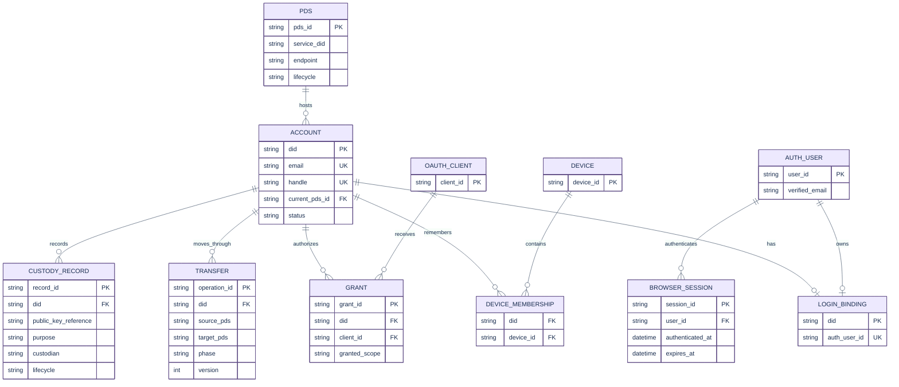
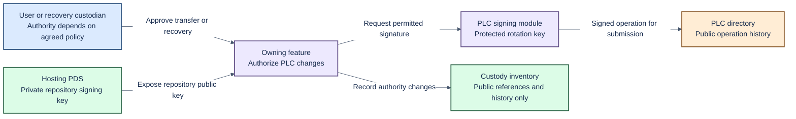

# Data model, identity custody and migration

Status: current storage facts plus proposed domain contracts. Updated: 2026-10-06.
See [architecture](architecture.md) for domain ownership and [delivery reference](delivery-plan.md) for delivery gates.

## 1. Account identity and ownership

Use the DID as the account primary key. A separate account UUID is not required by the agreed scope.
Better Auth user IDs, browser-session IDs, devices, grants and migration-operation IDs remain separate identifiers.

The current schema enforces one unique email and one bound Better Auth user per DID.
Multiple accounts on a device do not imply multiple DIDs under one email identity.
Changing that cardinality requires an explicit product decision and a revised schema.
The current code refactor does not require upgrading existing databases.

| State | Domain or system owner | Current representation |
| --- | --- | --- |
| Account identity and status | Accounts | `accounts`, keyed by DID |
| Login identity binding | Accounts | `account_bindings`, unique DID and Better Auth user |
| Email and handle claims | Accounts | Transactional claim tables with uniqueness constraints |
| Verified browser identity and sessions | Access / Better Auth adapter | Better Auth-owned tables |
| Device-to-account membership | Access | Indexed provider membership by DID and device ID |
| Clients, grants and protocol state | Access / OAuth provider adapter | Provider stores, partly using namespaced JSON storage |
| Current placement | PDS fleet, exposed through Accounts | `pds_id` in the account row; static configuration supplies hosts |
| Transfer progress | PDS fleet workflow | Legacy operation store and newer versioned workflow/checkpoint tables |
| Public custody evidence | Identity | Import-time custody inventory; not a complete key lifecycle registry |
| Repository, blobs and repository key | Hosting PDS | Reference PDS-managed storage |

The database boundary stores account authority, browser authentication, OAuth
state, mail and workflow journals in one selected database: `account-authority.sqlite`
under `STATE_DIRECTORY` (default `/data`) for SQLite, or the configured PostgreSQL
database. Table and variable names describe their purpose, without
project prefixes. `accounts` stores DID authority; `account_bindings` links a DID
to a verified Better Auth user, while Better Auth owns the distinct `account`
table. `email_claims`, `handle_claims` and `backup_emails` hold account claims;
`migration_reservations` holds destination reservations; `key_value_state` holds
namespaced JSON state; `schema_identity` records the exact fresh schema asset hash.

This naming change starts from a fresh database. There is no data conversion,
old-name alias or automatic upgrade from the earlier schema. New installs and
sandbox runs initialize the renamed schema directly. Backups must come from the
same schema generation. Upstream PDS configuration keys retain their mandated
names.

The implemented database boundary uses Drizzle ORM `1.0.0-rc.4` for SQLite and
PostgreSQL. Single-node operation supports either database; multi-node operation
requires PostgreSQL. Both must preserve the same identity, uniqueness and atomicity rules;
dialect-specific indexes, JSON queries, timestamps and error translation stay
inside the database adapter. Fresh schemas replace old layouts without a data
conversion path. Focused contracts verify both dialects; full fresh acceptance
and the authored PostgreSQL application restart/restore profile remain unrun.
Shared operation/mail ownership and replica failover remain implementation work.
See [database configuration](database.md). The existing ePDS deployment-conversion
requirement is separate.

## 2. Logical model

This diagram describes the proposed relationships. It does not prescribe new physical tables for provider-owned data.
The PDS registry and repeatable transfer history are target additions. The current journal limits a DID to one workflow.

Device membership requires uniqueness for its device/DID pair.
Grant/session implementation must retain the provider's real cardinalities and token-family semantics.
The logical `GRANT` box is not permission to replace the provider's schema.
The target allows many historical transfers per DID, with at most one active transfer.

## 3. Transaction and storage rules

- Keep identity binding, email authority and claim changes atomic on both databases.
- Await database operations and carry one transaction context through all authority changes.
- Use database-backed ownership and conditional updates across application instances.
- Claim mail attempts and workflow execution atomically; reject stale completion.
- Increment rate counters and supersede challenges atomically across instances.
- Isolate pinned Better Auth table knowledge in an adapter with upgrade contract coverage.
- Do not distribute the existing transaction across unrelated API calls without equivalent consistency guarantees.
- Journal an operation before issuing its external side effect.
- Use stable operation IDs, version checks and idempotent checkpoints.
- Treat a timeout as an unknown outcome. Observe remote state before retrying a mutation.
- Reconcile local placement, DID document and PDS state after interruption.
- Keep snapshot payloads outside account rows; verify their manifest and digests before reuse.
- Retain history when completing a transfer. Release only its active-operation reservation.

The database foundation retains the imported account constraints and journal
invariants in fresh Drizzle schemas and transactional operations. Namespaced JSON
state and pinned provider-table integration stay inside the database boundary.
Repeatable transfer history and durable operation ownership remain separate work.

## 4. Custody boundaries

Hosting location and identity authority are separate concerns.
A move between managed PDS instances should preserve the DID and Entryway relationship.
The destination PDS owns its repository signing key. Entryway uses its public reference in identity operations.

| Material | Custody direction | Required decision or control |
| --- | --- | --- |
| Email proof and browser credentials | Access / Better Auth | Expiry, revocation, freshness and data retention |
| PLC rotation signing key | Entryway signer adapter | Provisioning, authorized operations, backup, rotation and recovery |
| User recovery key, when present | User or explicitly agreed recovery custodian | Supported key set, priority and proof requirements |
| Repository signing private key | Hosting PDS | Never copy into Entryway account or workflow state |
| OAuth issuer key | Access / provider adapter | Key lifecycle distinct from PLC and repository keys |
| Public custody records | Identity | Purpose, fingerprint, custodian, lifecycle and change history |

The current custody validator assumes four fixture-specific key purposes, including a user-held source recovery key.
That is useful import evidence, not a complete policy for all new and imported accounts.
Do not promise user-held recovery for an account that has no such key.
A specific production key-management product has not been selected.

## 5. Three migration cases

| Case | Stable state | Changing state | Required behavior |
| --- | --- | --- | --- |
| External PDS into Entryway | DID and user data | Account binding, host and permitted custody | Existing tool, normal credentials, no operator database edits |
| PDS A to PDS B within Entryway | DID, account binding and Entryway relationship | Placement, repository key reference and hosting endpoint | Resumable move with record/blob integrity and working client access |
| Entryway to external PDS | DID and user data | Host and custody relationship | User can leave through supported public protocol operations |

Email verification proves control of the destination login identity.
It does not prove control of an incoming DID.
The incoming contract must combine source-DID authority proof with secure destination binding.

### What the imported external fixture actually does

This diagram records existing choreography. It is not the agreed implementation of independent-tool migration.
Each checkpoint must describe observed state, not merely that an HTTP request was sent.

```mermaid
%%{init: {"theme":"base","themeVariables":{"primaryTextColor":"#172B4D","lineColor":"#45556C","edgeLabelBackground":"#FFFFFF","fontFamily":"Arial"},"flowchart":{"nodeSpacing":35,"rankSpacing":45,"curve":"linear"}}}%%
flowchart LR
  owner["Verify destination owner<br/>Reserve DID and destination"]
  snapshot["Freeze synthetic source<br/>Capture CAR and blobs"]
  handoff["Publish authority handoff<br/>Keep source host in DID document"]
  create["Journal move and create target<br/>PDS publishes PLC change"]
  freeze["Deactivate target<br/>Separate administrative call"]
  importData["Import and verify data<br/>Check commit and blob integrity"]
  bind["Bind account and activate target<br/>Observe final state"]
  retained["Retain inactive source<br/>Complete operation history"]
  owner -->|"Verified owner and source evidence"| snapshot
  snapshot -->|"Durable payload and digests"| handoff
  handoff -->|"Entryway authority observed"| create
  create -->|"Target creation observed"| freeze
  freeze -->|"Target inactive"| importData
  importData -->|"Integrity verified"| bind
  bind -->|"Target active and binding committed"| retained
  classDef blue fill:#DBEAFE,stroke:#315582,color:#172B4D,stroke-width:2px;
  classDef mint fill:#DCFCE7,stroke:#32694D,color:#172B4D,stroke-width:2px;
  classDef peach fill:#FFEDD5,stroke:#8A5A2B,color:#172B4D,stroke-width:2px;
  classDef violet fill:#EDE9FE,stroke:#65538A,color:#172B4D,stroke-width:2px;
  class owner blue;
  class snapshot,importData,retained mint;
  class create,freeze peach;
  class handoff,bind violet;
```

Target creation is not atomically inactive. Public identity can change before repository import.
Investigate client and relay observations, interruption recovery and standard-tool compatibility around the known PDS contract.
No PDS modification is proposed.

## 6. Decisions and corrections required

| Item | Required outcome |
| --- | --- |
| Incoming tool contract | Pin tools and prove their public endpoint/credential sequence |
| Custody policy | Define supported recovery authorities, priority and departure rules |
| Cutover recovery | Reconcile partial PLC publication, target creation and import |
| Repeated moves | Many operations per DID; one active operation; safe return to an earlier host |
| Empty repositories | Accept valid zero-record and zero-blob accounts |
| Active client sessions during movement | Define refresh, audience and reauthorization behaviour |
| Retention and retirement | Keep source data until the agreed deletion conditions hold |

The independent-tool contract is an early delivery gate.
The private source fixture remains valuable for deterministic failures, but cannot substitute for that gate.

## Required account and recovery decisions

The current unique-email schema is a starting implementation, not a settled
product requirement. Multiple-DID email binding and duplicate-email incoming
migration need an explicit decision. Email verification must never merge
identities or substitute for proof of DID control.

Recovery policy must define authority and available data when the old Entryway is
offline or refuses assistance. Accounts without independent recovery authority
need explicit limitations. Existing ePDS deployment conversion separately covers
transferring account authority and protected keys. Decisions and their acceptance
criteria live in the [Linear project](https://linear.app/hypercerts/project/epds-entryway-888a35a63fe4) and [project document](https://linear.app/hypercerts/document/m1-acceptance-matrices-epds-parity-protocol-and-migration-196f21e01e71).
