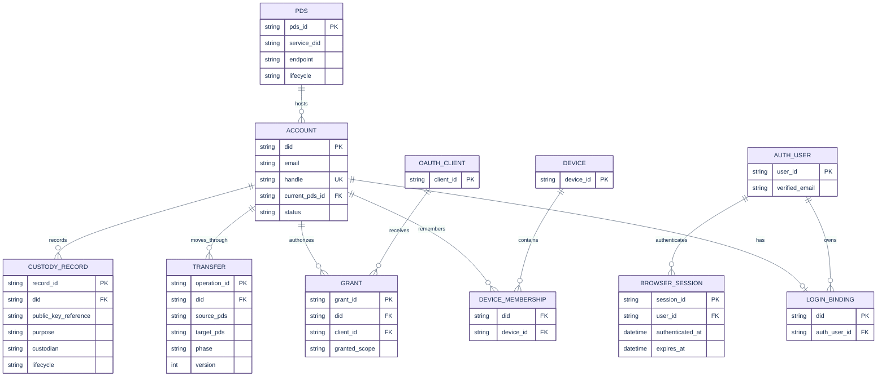
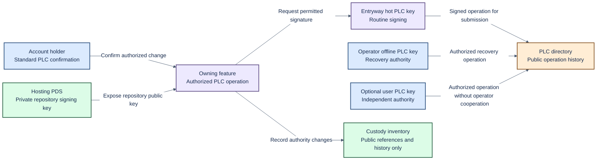

# Data model, identity custody and migration

Status: current storage facts plus proposed domain contracts. Updated: 2026-10-07.
See [architecture](architecture.md) for domain ownership and [delivery reference](delivery-plan.md) for delivery gates.

## 1. Account identity and ownership

Use the DID as the account primary key. A separate account UUID is not required by the agreed scope.
Better Auth user IDs, browser-session IDs, devices, grants and migration-operation IDs remain separate identifiers.

The approved target permits one verified email identity to be associated with
multiple DIDs when an existing PDS joins Entryway and its DID/email associations
are imported. Each DID remains a separate account with at most one login binding;
associations never merge DIDs. An email match alone cannot establish authority over
an unimported DID.

Sign-in verifies the email before resolving its associated DIDs. One associated
DID continues directly; multiple associated DIDs require an explicit account
choice. The selected DID then continues the original authentication or
authorization flow before a session for that DID is established. Better Auth's
email-level browser session is distinct from this selected-account session.

The current implementation still enforces a unique account email and a unique
Better Auth user in the DID binding. The schema changes, joining-PDS association
import and post-verification chooser are not implemented. The table below records
current storage, not the approved target. Internal refactoring does not require
upgrading existing databases; public account migration and existing ePDS deployment
conversion remain separate requirements.

| State                                  | Domain or system owner              | Current representation                                                |
| -------------------------------------- | ----------------------------------- | --------------------------------------------------------------------- |
| Account identity and status            | Accounts                            | `accounts`, keyed by DID                                              |
| Login identity binding                 | Accounts                            | `account_bindings`, unique DID and Better Auth user                   |
| Email and handle claims                | Accounts                            | Transactional claim tables with uniqueness constraints                |
| Verified browser identity and sessions | Access / Better Auth adapter        | Better Auth-owned tables                                              |
| Device-to-account membership           | Access                              | Indexed provider membership by DID and device ID                      |
| Clients, grants and protocol state     | Access / OAuth provider adapter     | Provider stores, partly using namespaced JSON storage                 |
| Current placement                      | PDS fleet, exposed through Accounts | `pds_id` in the account row; static configuration supplies hosts      |
| Transfer progress                      | PDS fleet workflow                  | Legacy operation store and newer versioned workflow/checkpoint tables |
| Public custody evidence                | Identity                            | Import-time custody inventory; not a complete key lifecycle registry  |
| Repository, blobs and repository key   | Hosting PDS                         | Reference PDS-managed storage                                         |

The database boundary stores account authority, browser authentication, OAuth
state, mail and workflow journals in one selected database: `account-authority.sqlite`
under `STATE_DIRECTORY` (default `/data`) for SQLite, or the configured PostgreSQL
database. Table and variable names describe their purpose, without
project prefixes. `accounts` stores DID authority; `account_bindings` links a DID
to a verified Better Auth user, while Better Auth owns the distinct `account`
table. `email_claims`, `handle_claims` and `backup_emails` hold account claims;
`migration_reservations` holds destination reservations; `key_value_state` holds
namespaced JSON state; `schema_identity` records the exact fresh schema asset hash.

This naming change starts from a fresh database. There is no data conversion,
old-name alias or automatic upgrade from the earlier schema. New installs and
sandbox runs initialize the renamed schema directly. Backups must come from the
same schema generation. Upstream PDS configuration keys retain their mandated
names.

The implemented database boundary uses Drizzle ORM `1.0.0-rc.4` for SQLite and
PostgreSQL. Single-node operation supports either database; multi-node operation
requires PostgreSQL. Both must preserve the same identity, uniqueness and atomicity rules;
dialect-specific indexes, JSON queries, timestamps and error translation stay
inside the database adapter. Fresh schemas replace old layouts without a data
conversion path. [Shared ownership and recovery](shared-operations.md) defines
account/mail coordination and operator-verified recovery. [Deployment profiles](deployment-profiles.md)
cover bounded node loss and shared-database refusal/recovery; they do not qualify
general disaster recovery or change custody. See [database configuration](database.md).
The existing ePDS deployment-conversion requirement is separate.

## 2. Logical model

This diagram describes the target relationships, including the approved multiple-DID email association.
It does not prescribe new physical tables for provider-owned data.
The PDS registry and repeatable transfer history are target additions. The current journal limits a DID to one workflow.

In the target, account email and the binding's `auth_user_id` are nonunique; the
DID remains the account primary key and permits only one binding per DID.
`BROWSER_SESSION` represents the email-level Better Auth session, not selected-DID
authentication. The [login sequence](architecture.md#5-login-and-application-authorization)
keeps those steps separate.

Device membership requires uniqueness for its device/DID pair.
Grant/session implementation must retain the provider's real cardinalities and token-family semantics.
The logical `GRANT` box is not permission to replace the provider's schema.
The target allows many historical transfers per DID, with at most one active transfer.

## 3. Transaction and storage rules

- Keep identity binding, email authority and claim changes atomic on both databases.
- Await database operations and carry one transaction context through all authority changes.
- Use database-backed ownership and conditional updates across application instances.
- Claim mail attempts and workflow execution atomically; reject stale completion.
- Increment rate counters and supersede challenges atomically across instances.
- Isolate pinned Better Auth table knowledge in an adapter with upgrade contract coverage.
- Do not distribute the existing transaction across unrelated API calls without equivalent consistency guarantees.
- Journal an operation before issuing its external side effect.
- Use stable operation IDs, version checks and idempotent checkpoints.
- Treat a timeout as an unknown outcome. Observe remote state before retrying a mutation.
- Reconcile local placement, DID document and PDS state after interruption.
- Keep snapshot payloads outside account rows; verify their manifest and digests before reuse.
- Retain history when completing a transfer. Release only its active-operation reservation.

The database foundation retains the imported account constraints and journal
invariants in fresh Drizzle schemas and transactional operations. Namespaced JSON
state and pinned provider-table integration stay inside the database boundary.
Repeatable transfer history remains separate work. [Durable operation ownership and
verified recovery](shared-operations.md) do not establish a complete custody or
repeated-transfer product.

## 4. Custody boundaries

Hosting location and identity authority are separate concerns. A move between
managed PDS instances preserves the DID and Entryway relationship. The PDS retains
its private repository signing key; Entryway uses only the public reference in
identity operations. Repository signing and PLC rotation are distinct authorities.

The approved approach follows the [Rust Entryway design reference](reuse-assessment.md#custody-design-reference):
Entryway holds a hot PLC rotation key and the operator keeps an offline recovery
key. A user recovery key is optional and may be added during migration or any
other authorized PLC operation. For new genesis, the priority is the user key if
supplied, then the operator offline key, then the hot Entryway key. This is not a
requirement for exactly three rotation keys. When an existing PDS joins, preserve
its existing PLC rotation authority subject to valid PLC rules and limits; do not
replace it mechanically with the genesis arrangement or assume that its repository
signing key is a recovery key.

These are the target custody rules, not a claim that their provisioning, migration
or recovery workflows are implemented.

| Material                            | Custody direction                 | Rule and remaining operational work                                                    |
| ----------------------------------- | --------------------------------- | -------------------------------------------------------------------------------------- |
| Email proof and browser credentials | Access / Better Auth              | Destination login binding; expiry, revocation, freshness and retention remain separate |
| Hot PLC rotation signing key        | Entryway signing module           | Routine authorized operations; provisioning, backup and rotation need implementation   |
| Offline PLC recovery key            | Operator, offline                 | Recovery authority; protection and recovery procedures need qualification              |
| User recovery key, when supplied    | User or user-authorized custodian | Optional PLC rotation authority; may be added through an authorized PLC operation      |
| Repository signing private key      | Hosting PDS                       | Distinct from PLC rotation; never copy into Entryway account or workflow state         |
| OAuth issuer key                    | Access / provider adapter         | Lifecycle distinct from PLC and repository keys                                        |
| Public custody records              | Identity                          | Public purpose, fingerprint, custodian, lifecycle and change history                   |

Normal departure uses standard PLC confirmation, signing and publication. A valid
destination key set may replace former host authority; no separate operator
approval or equality between source and destination emails is required. A user
can leave without a refusing operator only when they control or can authorize a
valid PLC rotation key independently. The operator's offline key alone does not
provide that independence. Identity control also cannot recover repository or
blob data that is unavailable; source availability or a usable backup remains a
separate requirement.

The current custody validator assumes four fixture-specific key purposes,
including a user-held source recovery key. Those purposes are not a required
rotation-key count or proof that every account has user recovery authority.
A production key-management product, retention periods and detailed provisioning
procedures are not selected by this policy.

## 5. Migration and whole-PDS joining

| Case                                      | Stable state                                                | Changing state                                           | Required behavior                                                                                       |
| ----------------------------------------- | ----------------------------------------------------------- | -------------------------------------------------------- | ------------------------------------------------------------------------------------------------------- |
| Individual external account into Entryway | DID and user data                                           | Login binding, host and permitted PLC authority          | Public protocol operations and normal credentials; no operator database edits or private fixture APIs   |
| PDS A to PDS B within Entryway            | DID, account binding and Entryway relationship              | Placement, repository key reference and hosting endpoint | Resumable move with record/blob integrity and working client access                                     |
| Individual account leaving Entryway       | DID and user data                                           | Host and permitted PLC authority                         | Valid destination keys may replace former host authority through standard PLC operations                |
| Whole existing PDS joining Entryway       | DIDs, hosted data and valid existing PLC rotation authority | Entryway integration and login associations              | Import established DID/email associations, including multiple DIDs for one email; do not merge accounts |

For an individual migration, the standard PLC confirmation, signature and
publication flow authorizes the DID transition. Source and destination email
addresses may differ. Destination email verification establishes the new login
binding; it is separate from PLC authority and introduces no bespoke DID-ownership
proof. Neither email equality nor an email match substitutes for the standard
PLC flow. Standard endpoint authentication, service-auth credentials, scopes and
audiences still apply; PLC authorization does not by itself authorize every
endpoint call.

Whole-PDS joining instead imports the established DID/email associations of that
PDS, as described in the [account model](#1-account-identity-and-ownership). It is
not an individual email-matching migration and does not require moving each
repository to a new host.

Migration acceptance is compliance with public protocol endpoints and normal
credentials. No particular migration tool or version must be selected. If a tool
is used, record its version for reproducibility; the client choice does not define
the acceptance contract.

### What the imported external fixture actually does

This diagram records existing synthetic choreography. It does not establish public-protocol migration compliance.
Each checkpoint must describe observed state, not merely that an HTTP request was sent.

```mermaid
%%{init: {"theme":"base","themeVariables":{"primaryTextColor":"#172B4D","lineColor":"#45556C","edgeLabelBackground":"#FFFFFF","fontFamily":"Arial"},"flowchart":{"nodeSpacing":35,"rankSpacing":45,"curve":"linear"}}}%%
flowchart LR
  owner["Verify destination owner<br/>Reserve DID and destination"]
  snapshot["Freeze synthetic source<br/>Capture CAR and blobs"]
  handoff["Publish authority handoff<br/>Keep source host in DID document"]
  create["Journal move and create target<br/>PDS publishes PLC change"]
  freeze["Deactivate target<br/>Separate administrative call"]
  importData["Import and verify data<br/>Check commit and blob integrity"]
  bind["Bind account and activate target<br/>Observe final state"]
  retained["Retain inactive source<br/>Complete operation history"]
  owner -->|"Verified owner and source evidence"| snapshot
  snapshot -->|"Durable payload and digests"| handoff
  handoff -->|"Entryway authority observed"| create
  create -->|"Target creation observed"| freeze
  freeze -->|"Target inactive"| importData
  importData -->|"Integrity verified"| bind
  bind -->|"Target active and binding committed"| retained
  classDef blue fill:#DBEAFE,stroke:#315582,color:#172B4D,stroke-width:2px;
  classDef mint fill:#DCFCE7,stroke:#32694D,color:#172B4D,stroke-width:2px;
  classDef peach fill:#FFEDD5,stroke:#8A5A2B,color:#172B4D,stroke-width:2px;
  classDef violet fill:#EDE9FE,stroke:#65538A,color:#172B4D,stroke-width:2px;
  class owner blue;
  class snapshot,importData,retained mint;
  class create,freeze peach;
  class handoff,bind violet;
```

Target creation is not atomically inactive. Public identity can change before repository import.
Investigate client and relay observations, interruption recovery and public-protocol compatibility around the known PDS contract.
No PDS modification is proposed.

## 6. Decisions and corrections required

| Item                                   | Required outcome                                                               |
| -------------------------------------- | ------------------------------------------------------------------------------ |
| Public migration contract              | Prove public endpoint/credential compliance; record tool versions only if used |
| Custody implementation                 | Implement the approved key roles, valid priority and ordinary departure rules  |
| Cutover recovery                       | Reconcile partial PLC publication, target creation and import                  |
| Repeated moves                         | Many operations per DID; one active operation; safe return to an earlier host  |
| Empty repositories                     | Accept valid zero-record and zero-blob accounts                                |
| Active client sessions during movement | Define refresh, audience and reauthorization behaviour                         |
| Retention and retirement               | Keep source data until the agreed deletion conditions hold                     |

Public-protocol migration remains a release acceptance requirement. Tool selection
is not a prerequisite. The private source fixture remains valuable for deterministic
failures, but cannot substitute for public endpoint and credential coverage.

## Required recovery decisions

The multiple-DID email policy is settled as described [above](#1-account-identity-and-ownership);
its implementation is pending. Import must establish the DID/email association
under the account-authority contract. Email verification cannot substitute for
that authority or merge identities.

The key roles and normal departure rules are settled above. Remaining work covers
provisioning, protection, backup/rotation procedures, recovery execution and data
availability when the old Entryway is offline or refuses assistance. Accounts
without independently usable rotation authority need explicit exit limitations;
an operator offline key is not a substitute. Existing ePDS deployment conversion
also needs its account-authority and key-transition implementation. These are
later authentication, migration/fleet and operational delivery requirements, not
new database or deployment foundation work. Decisions and acceptance criteria live in the [Linear project](https://linear.app/hypercerts/project/epds-entryway-888a35a63fe4) and [project document](https://linear.app/hypercerts/document/m1-acceptance-matrices-epds-parity-protocol-and-migration-196f21e01e71).
