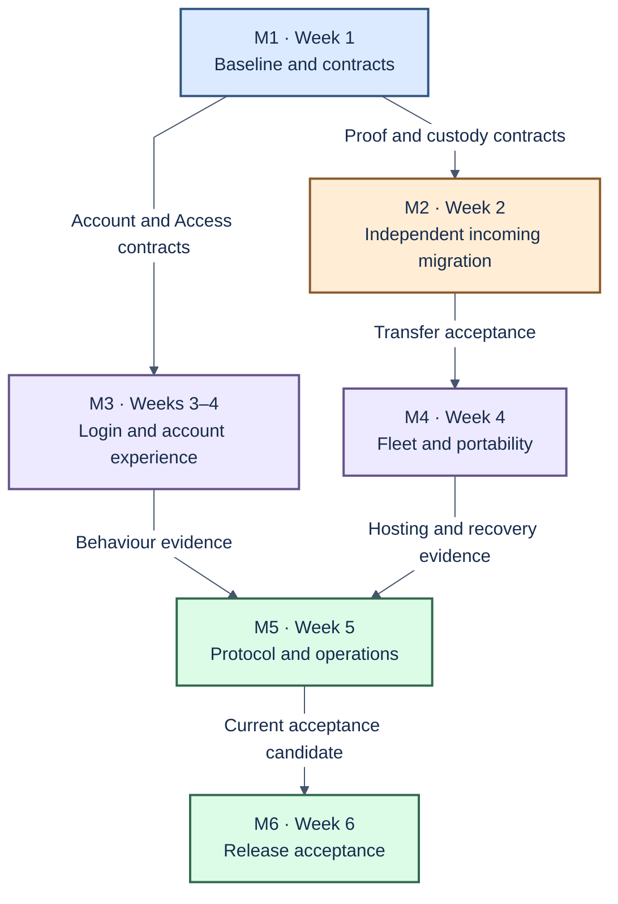

# Linear project plan: Mini Entryway

Status: delivery plan recorded in Linear. Updated: 2026-09-30.
The existing Linear project is ePDS Entryway (project ID `1d246d97-8a80-441f-b78a-27ef007480e2`). TECH-565 and TECH-547 already belong to it. The six delivery milestones and 24 issues below have been created.
M1–M6 and I01–I24 are stable planning keys; issue links below lead to their Linear records.

## Project description

Build a small TypeScript Entryway for several unchanged Bluesky reference PDS instances.
Move ePDS email OTP behaviour into the existing Entryway hooks and provide a styled account page.
Users must migrate independently with existing, unmodified tools.
Operators must register a PDS, place accounts, drain it and retire it safely.

The four feature domains are Accounts, Access, Identity and PDS fleet.
Registration and migration coordinate those domains through ports and adapters.
Keep the upstream ATProto OAuth provider, Better Auth browser authentication and the single-process SQLite starting point.

Google/GitHub login, PDS modifications, automatic balancing, autoscaling and distributed deployment are excluded.
Applicable ATProto/XRPC compliance, ePDS behaviour parity, custody and independent migration remain mandatory.

### Repository links

The planned repository is [hypercerts-org/hypercerts-entryway](https://github.com/hypercerts-org/hypercerts-entryway).
Code and documentation links use its proposed `main` branch.
They are publication-ready links; they may not resolve until the repository is pushed.
Existing paths were matched to this local checkout. Proposed new files are named explicitly instead of linked as existing code.
Update the branch in these links if the published default branch differs.

## Core references

Read these references when preparing the existing Linear project and when changing a shared contract:

1. [Lexidraw: Entryway architecture and authorization flows](https://lexidraw.app/s/kandake.africa/3mvrtiqigo32i).
2. [Lexidraw: spike architecture, data model and custody](https://lexidraw.app/s/did%3Aplc%3Alrphxvv25aibthe7xoc2eeyy/3mwlv6d5ddp23).
3. [Repository architecture](https://github.com/hypercerts-org/hypercerts-entryway/blob/main/docs/architecture.md) and [data and custody design](https://github.com/hypercerts-org/hypercerts-entryway/blob/main/docs/data-custody.md).
4. [Spike reuse assessment](https://github.com/hypercerts-org/hypercerts-entryway/blob/main/docs/reuse-assessment.md) and [imported source mapping](https://github.com/hypercerts-org/hypercerts-entryway/blob/main/docs/source-map.json).
5. [Local test guide](https://github.com/hypercerts-org/hypercerts-entryway/blob/main/docs/testing.md) and [acceptance plan](https://github.com/hypercerts-org/hypercerts-entryway/blob/main/tests/plans/local-acceptance.md).

The diagrams are core design references, not proof that every depicted capability is implemented.
Use the repository documents for current scope and recorded open decisions.
Resolve any conflict in a decision record reviewed by both developers.

## Requirements carried forward

[TECH-565](https://linear.app/hypercerts/issue/TECH-565) supplies the redesign and existing-account transition requirements. [TECH-547](https://linear.app/hypercerts/issue/TECH-547) supplies the operator-independence and email-discovery questions addressed by I23/I24. Passwordless regression cases from [TECH-379](https://linear.app/hypercerts/issue/TECH-379) remain required even though its old implementation was canceled. Old-link and origin-transition requirements from [TECH-534](https://linear.app/hypercerts/issue/TECH-534) are included in I22.

The expanded work must be estimated after the M1 decisions; the original forecast is not evidence that these additions fit the same capacity.

## Glossary

| Term | Meaning in this project |
| --- | --- |
| Mini Entryway | Account authority and OAuth authorization server for a small fleet of PDS instances. |
| ePDS parity | Matching the agreed email OTP login behaviour and account experience, without carrying over PDS overrides. |
| PDS | Personal Data Server. Hosts repositories, blobs and repository signing keys. |
| PDS fleet | Domain that manages host registration, placement, transfers, draining and retirement. |
| Account | An Entryway-managed ATProto identity, keyed by its DID. |
| DID | Stable decentralized identifier. Changing hosts does not create a new account identity. |
| Handle | Human-readable account name that resolves to a DID. |
| PLC | Identity directory used for `did:plc` documents and their signed operation history. |
| Custody | Who can use a key or authorize an identity change, transfer or recovery. |
| Rotation key | Key authorized to sign PLC identity operations, subject to the directory's rules. |
| Repository key | PDS-held private key that signs repository commits; distinct from PLC authority. |
| Better Auth | Library supplying email proof and browser authentication. It is not the ATProto authorization server. |
| OTP | One-time email code used to prove control of an email address. |
| Browser session | Login state used by Entryway's browser pages. Separate from client OAuth authorization. |
| Device membership | Association between a remembered device and an account DID. |
| Grant | Permissions approved for an OAuth client and account. |
| XRPC | ATProto HTTP API method convention, with contracts defined by lexicons. |
| Lexicon | Schema defining an ATProto method, record or related data structure. |
| PAR | Pushed Authorization Request; submits authorization parameters before browser authorization. |
| PKCE | Proof Key for Code Exchange. A secret created by the client protects the authorization code from use by another client. |
| DPoP | Demonstrating Proof of Possession. The client signs requests to prove it holds the key associated with its token. |
| Port / adapter | A port defines an interface required by a domain. An adapter connects that interface to a database, network service or library. |
| Placement | The committed hosting PDS for an account, with any pending transfer tracked separately. |
| Drain / retire | Stop new placements and move accounts / remove a host from service after all retirement checks pass. |
| Journal / checkpoint | Durable operation history / recorded progress used to resume or reconcile an operation. |
| Reconciliation | Compare recorded intent with observed external state and finish or safely stop an operation. |
| AiaB | Atmosphere in a Box; the isolated local ATProto test environment. |
| Test service | Local service that creates or controls test accounts. A successful test with private APIs does not establish compatibility with public migration tools. |
| Acceptance criterion | Observable result required to complete an issue or milestone. |
| Contract | Agreed inputs, outputs, errors and permission rules for an interface. |
| Domain | A part of the system with one business responsibility, such as Accounts or Identity. |
| Atomic transaction | Related database changes that either all succeed or all fail. |
| Baseline | Recorded behaviour and test results for the starting code revision. |
| Acceptance matrix | Table of required behaviours, their tests, owners and results. |
| Source proof | Evidence that the caller controls the DID being moved from another PDS. |
| Public / confidential client | An app that cannot keep a client credential secret / an app that can, usually on a server. |
| CID | Content identifier used to identify a particular encoded record or blob. |
| Cutover | The point when the account identity starts referring to the destination PDS. |
| CSRF | A browser attack that causes unwanted requests; request checks protect account actions. |
| CSP | Content Security Policy; browser rules that restrict which scripts and content may run. |

## Protocol documentation

These links were found with the ATProto documentation MCP. Specifications define protocol requirements; guides explain implementation approaches. They do not prove that the spike meets those requirements. Pin the PDS and client versions in acceptance reports.

| Reference | Use in this plan |
| --- | --- |
| [OAuth specification](https://atproto.com/specs/oauth) | Protocol requirements for client authorization and tokens. |
| [XRPC specification](https://atproto.com/specs/xrpc) | HTTP methods, errors and service authentication. |
| [Account hosting specification](https://atproto.com/specs/account) | Account status, hosting and migration requirements. |
| [Account migration guide](https://atproto.com/guides/account-migration) | Transfer steps and existing tools; these detailed mechanisms are guidance and may evolve. |
| [DID specification](https://atproto.com/specs/did) | Account identity, public keys and the current PDS address. |
| [Account recovery guide](https://atproto.com/guides/account-recovery) | Rotation keys and recovery when a host is unavailable. |
| [Repository specification](https://atproto.com/specs/repository) | Signed data and repository commits. |
| [OAuth client implementation guide](https://docs.bsky.app/docs/advanced-guides/oauth-client) | Independent client discovery, authorization and identity checks. |

## Proposed Linear structure

| Field | Proposed value |
| --- | --- |
| Project name | ePDS Entryway (existing project) |
| Project summary | ePDS email OTP behaviour through stock PDS Entryway hooks, with portable identities and a managed PDS fleet |
| Initial status | Planned; change after approval and kickoff |
| Milestones | M1 through M6 below, created in dependency order |
| Issues | 24 issues in the [ePDS Entryway project](https://linear.app/hypercerts/project/epds-entryway-888a35a63fe4/issues) |
| Assignees | Developer A or B placeholders; resolve to actual Linear users when creating issues |
| Domain labels | `accounts`, `access`, `identity`, `pds-fleet`, `integration` |
| Work labels | `reuse-extract`, `implementation`, `investigation`, `acceptance`, `operations` |
| Priority | P0 = early dependency or mandatory blocker; P1 = required delivery work. All listed issues remain in scope. |
| Dates | Set relative to agreed kickoff; week numbers below are forecasts, not calendar commitments |

Each Linear issue contains its owner role, labels, dependencies, code focus, reusable components and acceptance criteria. The index below links the planning keys to the created issues. Imported code does not count as completed implementation.

## Milestones and acceptance criteria

### M1 — Establish the baseline and shared contracts

**Target:** end of week 1. **Owners:** both. **Issues:** I01, I02, I03, I23, I24.

- [ ] M1.1 A fresh AiaB baseline is recorded against the current repository revision, including failures and skipped cases.
- [ ] M1.2 Separate product parity, XRPC/PDS contract and migration interoperability matrices exist with evidence owners.
- [ ] M1.3 Both developers agree account binding, placement, signing, lifecycle and migration contracts, including errors and transaction rules.
- [ ] M1.4 Custody and incoming-tool decisions define source proof, destination credentials and recovery authority; unresolved items have an owner and resolution deadline before dependent implementation.
- [ ] M1.5 Both developers can run isolated local projects without sharing state or changing a PDS implementation.
- [ ] M1.6 Operator ownership and the separate email-discovery proposal are resolved in I23; supported independent-exit conditions are explicit.
- [ ] M1.7 I24 defines email-to-account rules and duplicate-email incoming migration before account contracts are accepted.

### M2 — Admit an independently migrated account

**Target:** end of week 2. **Owners:** B integration lead; A owns destination identity binding. **Issues:** I04, I05, I06, I07.

- [ ] M2.1 The selected unmodified migration tool completes a fresh external-to-Entryway transfer using normal public credentials and endpoints.
- [ ] M2.2 No operator database edit, private source test-service API or private recovery key supplied by test setup is required by that user journey.
- [ ] M2.3 Source DID ownership and destination email identity are verified separately and bound without duplicate identity claims.
- [ ] M2.4 The DID, record identifiers/content and referenced blobs are preserved; target hosting and identity state agree.
- [ ] M2.5 The migrated account signs in through Entryway, authorizes an independent client, writes to its PDS and refreshes authorization.
- [ ] M2.6 Observed cutover ordering and interruption behaviour are recorded against the unchanged reference PDS.

If M2 is blocked, revise the forecast immediately. An operator-controlled test service or PDS patch cannot satisfy it.

### M3 — Complete the email login and account experience

**Target:** end of week 3, with remaining login behaviour work no later than week 4. **Owner:** A. **Issues:** I08, I09, I10, I11.

- [ ] M3.1 The approved ePDS matrix passes for signup, returning OTP, account choice, hints, freshness, consent and recovery.
- [ ] M3.2 Previously approved clients and eligible trusted signup follow the agreed consent policy without transferring approval to another client.
- [ ] M3.3 The styled account page exposes account settings, browser sessions, remembered devices and application grants through owned domain APIs.
- [ ] M3.4 Revocation effects are explicit and exercised, including outstanding access-token lifetime and foreign-account isolation.
- [ ] M3.5 All supported email operations use the delivery adapter; sandbox evidence comes from Mailpit and production transport configuration is documented.
- [ ] M3.6 Keyboard, focus, error recovery and narrow-screen journeys satisfy the agreed accessibility acceptance cases.
- [ ] M3.7 Mixed fresh/expired account selection on authorization and account pages leads to OTP; Entryway password-related routes follow the approved policy.

### M4 — Operate and drain a multi-PDS fleet

**Target:** end of week 4. **Owner:** B. **Issues:** I12, I13, I14, I15.

- [ ] M4.1 Operators register a PDS and enable it only after trust, route and health checks.
- [ ] M4.2 New placement excludes draining, retired or unhealthy hosts.
- [ ] M4.3 Internal transfer preserves account identity and data; empty repositories and repeated moves are supported.
- [ ] M4.4 Interrupted transfer can resume or enter an explicit recovery state without operator SQL edits.
- [ ] M4.5 Draining stops new placement and schedules account moves; retirement is blocked by placements, active transfers and retention obligations.
- [ ] M4.6 A user can leave through an unmodified migration tool, with custody changes matching the approved policy.
- [ ] M4.7 Return to a previous host and retained-source cleanup follow documented, exercised rules.
- [ ] M4.8 Departure without assistance from the old Entryway is demonstrated for the recovery conditions approved in I03; limits and unavailable data are explicit.

### M5 — Close protocol and operational requirements

**Target:** end of week 5. **Owners:** both. **Issues:** I16, I17, I18, I22.

- [ ] M5.1 Every applicable XRPC/Entryway contract row has passing schema, credential, error and side-effect evidence; no endpoint-count shortcut is used.
- [ ] M5.2 Public and confidential OAuth client acceptance covers discovery, PAR, PKCE, DPoP, scope enforcement and lifecycle behaviour.
- [ ] M5.3 Backup and restore recover the documented Entryway/PDS state and key dependencies; reconciliation reaches a verified result.
- [ ] M5.4 Key rotation/recovery, deployment rollback and outstanding-token behaviour are documented and exercised for the supported deployment.
- [ ] M5.5 Health/readiness, safe logs, operation status, delivery failure and abuse controls provide actionable evidence without exposing credentials.
- [ ] M5.6 The imported outage/restart scenarios pass in the current harness; remaining capacity limits are recorded without claiming unmeasured scale.
- [ ] M5.7 I22 rehearses conversion of an existing ePDS deployment, including preserved data and authority, old URLs, sign-in and rollback.
- [ ] M5.8 The endpoint matrix distinguishes direct and forwarded credentials, and outage evidence identifies operations that continue or stop without Entryway.

### M6 — Accept and hand over the release

**Target:** end of week 6. **Owners:** both. **Issues:** I19, I20, I21.

- [ ] M6.1 Security, protocol integration and UX review findings are closed or explicitly triaged; no mandatory blocker is accepted as complete.
- [ ] M6.2 All milestone criteria link to current evidence for the release candidate, including fresh tool migration and independent client access.
- [ ] M6.3 An operator follows the runbook for deployment, host addition/drain, restore and supported recovery without undocumented steps.
- [ ] M6.4 Both developers record the release decision, supported versions, known limitations and ongoing ownership.
- [ ] M6.5 Review confirms removal of old PDS modifications and records the treatment of remaining private OAuth-provider APIs.

## Issue index and delivery sequence

| Planning key | Issue | Milestone | Owner | Blocking dependencies |
| --- | --- | --- | --- | --- |
| [I01](https://linear.app/hypercerts/issue/TECH-676) | Record a fresh baseline and acceptance matrices | M1 | A | None |
| [I02](https://linear.app/hypercerts/issue/TECH-677) | Agree domain contracts and enforce dependency rules | M1 | A; B reviews | I01, I23, I24 |
| [I03](https://linear.app/hypercerts/issue/TECH-678) | Decide custody and the standard-tool migration contract | M1 | B; A reviews | I01, I23 |
| [I04](https://linear.app/hypercerts/issue/TECH-679) | Extract atomic account binding and Access proof contracts | M2 | A | I02, I03, I24 |
| [I05](https://linear.app/hypercerts/issue/TECH-680) | Extract identity operations behind custody-aware ports | M2 | B | I02, I03 |
| [I06](https://linear.app/hypercerts/issue/TECH-681) | Implement the public incoming-migration API | M2 | B; A supplies binding adapter | I04, I05 |
| [I07](https://linear.app/hypercerts/issue/TECH-682) | Prove independent incoming migration and post-move OAuth | M2 | B; A reviews login evidence | I06 |
| [I08](https://linear.app/hypercerts/issue/TECH-683) | Complete ePDS consent and fresh-login behaviour | M3 | A | I02, I04 |
| [I09](https://linear.app/hypercerts/issue/TECH-684) | Expose device, browser-session and grant lifecycle APIs | M3 | A | I04, I08 |
| [I10](https://linear.app/hypercerts/issue/TECH-685) | Compose the styled account page through domain APIs | M3 | A | I04, I09 |
| [I11](https://linear.app/hypercerts/issue/TECH-686) | Complete delivery for every supported email operation | M3 | A | I02, I04 |
| [I12](https://linear.app/hypercerts/issue/TECH-687) | Add a durable PDS registry and placement eligibility | M4 | B | I02, I03 |
| [I13](https://linear.app/hypercerts/issue/TECH-688) | Generalize resumable transfers and preserve operation history | M4 | B | I05, I06, I12 |
| [I14](https://linear.app/hypercerts/issue/TECH-689) | Implement drain and guarded PDS retirement | M4 | B | I12, I13 |
| [I15](https://linear.app/hypercerts/issue/TECH-690) | Prove outward migration and custody release | M4 | B; A reviews credentials | I03, I05, I07, I13 |
| [I16](https://linear.app/hypercerts/issue/TECH-691) | Close the complete XRPC and OAuth contract matrix | M5 | A; B owns identity/fleet rows | I02, I06, I08, I13 |
| [I17](https://linear.app/hypercerts/issue/TECH-692) | Exercise backup, restore and signing-key operations | M5 | B | I05, I13, I14 |
| [I18](https://linear.app/hypercerts/issue/TECH-693) | Complete readiness, safe diagnostics and abuse controls | M5 | A; B owns transfer diagnostics | I08, I11, I13, I16 |
| [I19](https://linear.app/hypercerts/issue/TECH-694) | Review security and permission checks and the account experience | M6 | A; independent review, B joins custody review | I10, I11, I15, I16, I17, I18, I22 |
| [I20](https://linear.app/hypercerts/issue/TECH-695) | Record release-candidate acceptance across all milestones | M6 | B; A owns parity evidence | I07, I09, I14, I15, I16, I17, I18, I19, I22 |
| [I21](https://linear.app/hypercerts/issue/TECH-696) | Publish operator guidance and record the release decision | M6 | A; B owns custody and fleet procedures | I19, I20 |
| [I22](https://linear.app/hypercerts/issue/TECH-697) | Move an existing ePDS deployment to Entryway | M5 | A; B owns custody and PDS configuration | I04, I05, I08, I11, I16, I17 |
| [I23](https://linear.app/hypercerts/issue/TECH-698) | Decide operator ownership and the relationship to email discovery | M1 | Both | I01 |
| [I24](https://linear.app/hypercerts/issue/TECH-699) | Decide how email identities relate to multiple accounts | M1 | A; B reviews migration cases | I01 |

Milestone targets are exit dates, not barriers to starting later work.
Registry work can start after the shared contract is agreed; XRPC coverage grows from week 1.
Account UI composition can use agreed contract examples while Access implementation progresses.
A blocking dependency means accepted behaviour is required before the dependent issue is completed.

## Team operating model

Developer A owns Accounts and Access. Developer B owns Identity and PDS fleet.
Both review public contracts, storage migrations, custody policy and cross-domain workflows.
Assign a temporary owner for lockfiles, shared configuration and migration numbering.

| Check-in | Frequency | Output |
| --- | --- | --- |
| Integration and blockers | Daily, 15 minutes | Integrated state, owned blockers and next handoffs |
| Contracts and decisions | Twice weekly, 30 minutes | Approved changes or explicit decision tasks |
| Sandbox demonstration | Weekly, 45 minutes | Evidence against milestone criteria |
| Scope and forecast | Weekly, 20 minutes | Updated risks, sequencing and delivery forecast |

After one blocked working day, work together on the blocked integration and change ownership or sequencing.
Use separate worktrees, bounded agent tasks and small PRs. Each issue names owned code areas and existing components.
Humans retain design and merge decisions. Do not defer integration until week 6.
Use separate AiaB projects per worker; serialize migration and outage operations inside each project.

The forecast assumes both developers are available throughout the six weeks.
Protect review/integration time and week 6 defect capacity. Re-estimate after M1 and M2 from actual results;
issue count and code-generation speed are not a capacity estimate.

## Definition of done and Linear handoff

An issue is done only when its criteria pass, changes are reviewed, and current evidence is linked.
Record revision, versions, commands, results and unrun cases without credentials or private state.
A milestone is done only when all its own acceptance criteria are satisfied, even if all issues are closed.

Track implementation in the [ePDS Entryway project](https://linear.app/hypercerts/project/epds-entryway-888a35a63fe4/issues). The six delivery milestones and TECH-676 through TECH-699 were created in Linear; all new issues started in Backlog. Current status and blocking relationships are maintained there.

Attach current evidence to the relevant issue. Update this document when scope, milestone acceptance criteria or design decisions change. Developer A/B remain responsibility placeholders until assignees are agreed.
